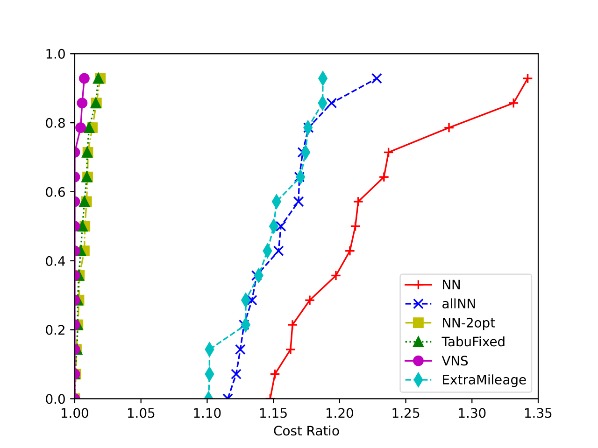
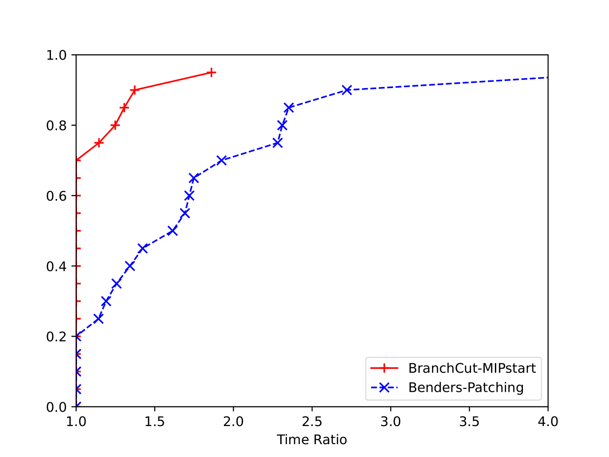
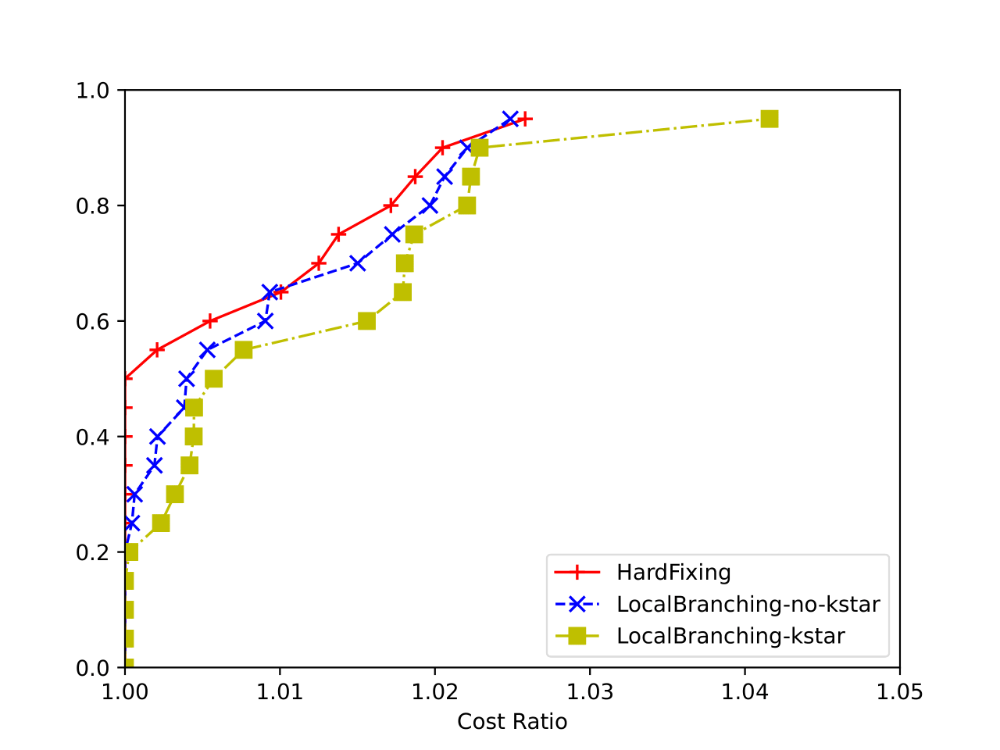

# Traveling Salesman Optimization


Repository containing the project developed during the Operations Research 2 course in the academic year 2023/24. 

The aim of the course is to explore different approaches for solving the famous Travelling Salesman Problem (TSP), ranging from very approximate solutions with heuristic algorithms down to exact methods employing CPLEX MIP solver. 

## 💻 Requirements 
Install the following libraries to build the C program:
*   **gnu make**, v.3.81
*   **gnuplot**, v6.0
*   **IBM ILOG CPLEX**, v22.11
*   **cmocka**, v1.1.7 (optional)

For the profiling, install requirements with ```pip install scripts/requirements.txt```. 

> [!WARNING]
> Works only on Linux and MacOS

## 🛠️ Usage
Once the repo is cloned, go to the folder and run ```make```. Once it has finished, the executable will be located in ```make/bin```.

To see the full list of commands, run 
```
make/bin/tsp --help
```

### Automated Profiling
To run profiling run:
```
python scripts/compare_algs.py {config file}
```
where ```config file``` is a configuration file in TOML format (for an example, see the [TOML template](/scripts/configs/template.toml)). This will create a .csv file in ```/results``` with times for each algorithm and each dataset.

Once done, run the profiling with:
```
python scripts/perfprof.py results/{filename}.csv results/{outputfile}.pdf
```

## 📺 Implemented Algorithms

* HEURISTICS
    * Nearest Neighbour
    * All Nearest Neighbour
    * All Nearest Neighbour + 2OPT
    * Extra Mileage
* META HEURISTICS
    * Tabu Search
    * Variable Neighborhood Search
* EXACT METHODS
    * Benders Loop
    * Benders Loop with Patching
    * Branch & Cut
* MATH HEURISTICS
   * Hard Fixing
   * Local Branching   

Each algorithm has a set of hyper-parameters to change the behaviour or fine-tune the execution. Run the help command to see the full list.

## 📈 Results

Heuristics perform exceptionally well with 2000 nodes, whereas exact models struggle even with 400 nodes. However, this speed advantage comes with a trade-off: the best metaheuristic (VNS) has a gap of less than 4\% from the optimal solution. 


For exact solutions, the best choice, in terms of the time to reach the optimal solution, is Branch\&Cut with fractional cuts and a heuristic initial solution.


Matheuristics are effective when exact models cannot find the optimal solution within a feasible time limit, enabling us to solve instances with more nodes by leveraging the CPLEX mathematical model. The best performing matheuristic is Hard Fixing, though it has a small gap compared to Local Branching. 


Further results can be found in the [project report](./BolzonelloVendramin_OR2report.pdf) 

## 🛡️ License


